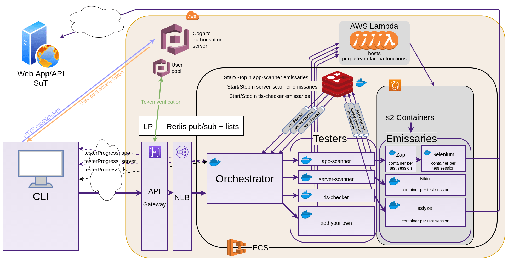

# cloud

Everything in this sub-section applies to running the purpleteam CLI configured for the `cloud` environment.

# purpleteam `cloud` Architecture

The following diagram shows how the purplteam components communicate. In the `cloud` environment all you need to be concerned with is the purpleteam CLI and of course making sure your [System Under Test (SUT)](definitions.md) is listening, in a clean state, and reachable from the Cloud:

# Your System Under Test (SUT)

Make sure the Web application or API (SUT) that you wish to target is up and responding to requests.

If your SUT is not yet ready, an option may be to use what the purpleteam-labs development team uses for their SUTs ([purpleteam-iac-sut](https://github.com/purpleteam-labs/purpleteam-iac-sut)). Purpleteam-labs use purpleteam-iac-sut for both `local` and `cloud` testing.

# purpleteam (CLI)

Details on installing the purpleteam CLI, configuring and running can be found [here](https://github.com/purpleteam-labs/purpleteam)

Once you have the CLI running and if you want or need to debug it, details can be found [here](local/local-workflow.md#front-end).
